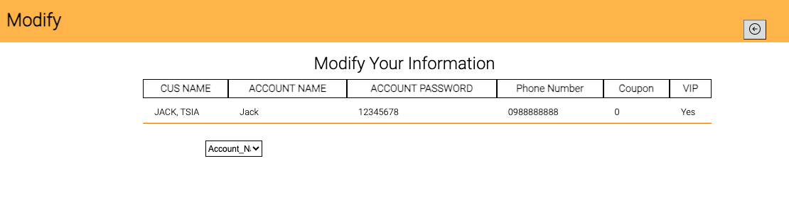

# Bookstore Website
## 1.Introduction
This website is a project that contain basic functions about how a bookstore website work

#### Customer side 
 1. Login, Logout, Register System
 2. Search for book
 3. Cart
 4. Invoice
 5. Edit customer information
 6. Edit customer's invoice information

#### Manager side
 1. Check, Update Inventory
 2. Check, Update Invoice
 3. Check, Update Customer information
 4. Check Finance status

## 2.Language & Environment Setup
 1. HTML, CSS, Javascript, php, SQL
 2. MAMP to connect Database
 3. Faker package to generate fake books

## 3.ERD Diagram

## 4.Demo
#### Login:

 1. If you enter the wrong password or have not register yet, it will alert
 2. If you left the unfill blank, it will alert
#### Register & Register Manager:

 1. If you use account name same as another user, it will alert
 2. If you left the unfill blank, it will alert
#### BookStore main page:
 1. Filter: It can change the the search result based on your Publication Year, Price
 2. Search button: It can change the the search result based on your Author, Bookname
 3. Detail: click the icon can show more detail of the book , such as price, amount...
 4. Add to cart: It will increase the number on cart icon in navbar
 5. logout icon: If logout and login again, the record still remain the same
 6. Invoice record: It show the book customer buy and detail
    
 7. Customer information: It allow customer to change informatin
    

#### Cart page:
  1. Amount of book: Choose what number of books to select
  2. Remove: Remove the book

    

